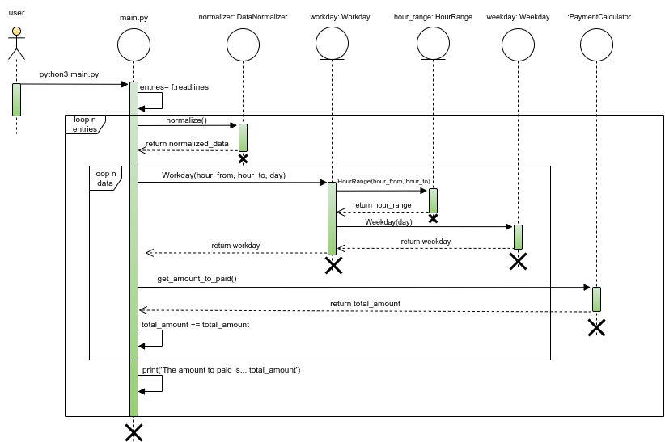

# Payment Calculator

## Local installation (Linux)

1. Clone repository
   ```sh
   git clone git@github.com:Alaneta/PaymentCalculator.git
   ```
2. Enter data sets in entries.txt file. The application has initially 5 sets of data as an example. Please follow the
   same format to enter new data

3. Execute application
   ```sh
   python3 main.py 
   ```

## Unit tests execution

Unit tests are located in /tests folder. Your can run these with the following command:

   ```sh
   python3 -m unittest discover
   ```

## Overview of solution

* **Performance**: The solution was designed in order to avoid unnecessary loops what would affect the time response of
  the program. There are only 2 loops, one to get every input from the txt file and another one to get each day and hour
  range of each input obtained from the first loop.
* **Validations**: There are validations to avoid invalid data such as controlling the data format for every entry of
  the txt file (use of regex) and also there are validations for the day and hour range entered (use of python
  properties). The program will not accept invalid data format from the txt file, invalid day abbreviations and hour
  ranges were there are no information about the amount to be paid.
* **Calculation**: The program was designed not only to calculate the amount to be paid for a simple and accurate day
  and hour range. If the hour range worked includes more than one of the defined, the calculation takes this in
  consideration and uses the correct values for the amount to pay.
* **Adaptability**: The program has a good adaptability if suddenly the values of the amount to pay and the hour range
  of each day changes. This data is defined in the constants.py. In my opinion this data should be obtained from a
  database table so the code does not have to change in every price or hour range change. But this was out of scope of
  the exercise. However, if in certain point a database is going to be introduced to the application, the changes to be
  made will be few because it is all just about to replace the constant from constants.py for the result of querying the
  database table.

## Sequence Diagram



## Author

* **Alan Camussi** - Full Stack Web Developer - [Alaneta](https://github.com/Alaneta/PaymentCalculator)

<p align="right">(<a href="#top">volver a inicio</a>)</p>

<br>
